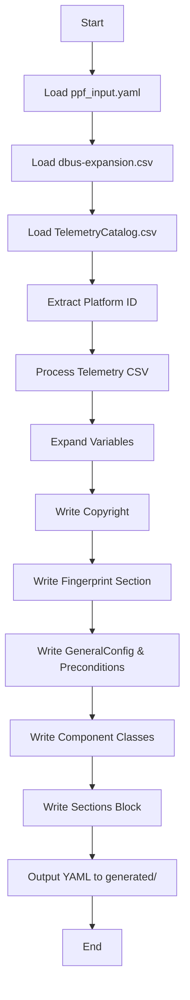

# YAML Generator

This project generates a platform-specific YAML configuration file for telemetry and sensor data collection, using a set of input files.

---

## 1. Code Flow

1. **Input Loading**
   - Reads `ppf_input.yaml` for platform, general config, and preconditions.
   - Loads expansion variables from `dbus-expansion.csv`.
   - Loads telemetry definitions from `TelemetryCatalog.csv`.

2. **Platform Identification**
   - Extracts platform ID from fingerprint or CSV.

3. **CSV Processing**
   - Parses telemetry CSV to extract component classes, metrics, and D-Bus parameters.
   - Expands variables using the expansion CSV.

4. **YAML Generation**
   - Writes copyright, fingerprint, general config, preconditions, and all component classes.
   - Handles YAML anchors and merge keys for compaction and log paths.
   - Outputs the final YAML file in the `generated/` directory.

---

## 2. Usage

```sh
python3 yaml_generator.py --input ppf_input.yaml --expansion dbus-expansion.csv --telemetry TelemetryCatalog.csv
```

- `--input`: Path to the main platform input YAML file (default: `ppf_input.yaml`)
- `--expansion`: Path to the expansion CSV file (required for variable expansion)
- `--telemetry`: Path to the telemetry catalog CSV file

The generated YAML will be placed in the `generated/` directory.

```
Note:
ppf_input.yaml is a required input file used by the automation script. It contains metadata necessary for YAML generation — such as platform name, source columns for DBus/SHMEM data, and other configuration fields.
```

---

## 3. Flow Chart Diagram



## 4. Telemetry Catalog Version

| S.No | Version | Date        | Comment                                                | Link |
|------|---------|-------------|--------------------------------------------------------|------|
| 1    | 0.1     | 16th June   | This version of the telemetry catalog based on 3.8 version of telemetry catalog | [TelemetryCatalog0.1.csv](https://docs.google.com/spreadsheets/d/1TZUCJklI6VuA5D-cexFzoaJ800dMcPN6Sx7YxzMt0yk/edit?gid=379180097#gid=379180097) |


